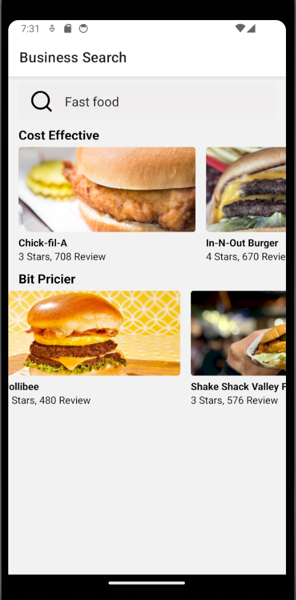
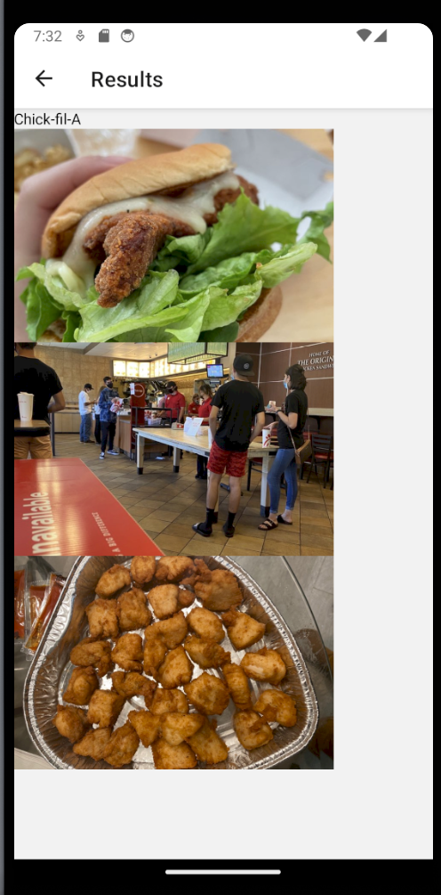

# Restaurant Search App

Discover your favorite restaurants with this React Native application. Utilizing Yelp's API, the app helps you find the perfect dining spot tailored to your preferences.

## Features

- **Yelp API Integration:** Leverages Yelp's API to provide accurate and up-to-date information about various restaurants.

- **React Navigation:** Implements react-navigation for seamless screen navigation, allowing users to easily move between screens and share additional information.

## Screenshots

<div style="display: flex; justify-content: space-around; align-items: center;">
  
  
  
</div>

## Getting Started

Follow these steps to get the application up and running on your local machine:

1. Clone the repository:
   ```bash
   git clone https://github.com/your-username/Blog-App.git
2. run the command `npm install`
3. run the command `npm start`
